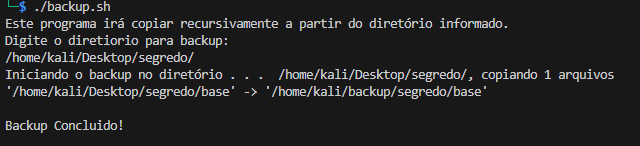

# Script Backup
## Script em shell que irá realizar a copia recursiva de arquivos no diretório indicado.
#### Exercício programa Desenvolve 2024 - Grupo Boticário em parceria com Alura.
#### Este script foi desenvolvido para fins didáticos. 
- De permissão de execução do backup.sh: `chmod u+x backup.sh`
- Execute o backup.sh `./backup.sh`
- Passe o caminho completo `/caminho/completo/do/diretorio/`
- O script deverá retornar algo parecido com a imagem abaixo.
